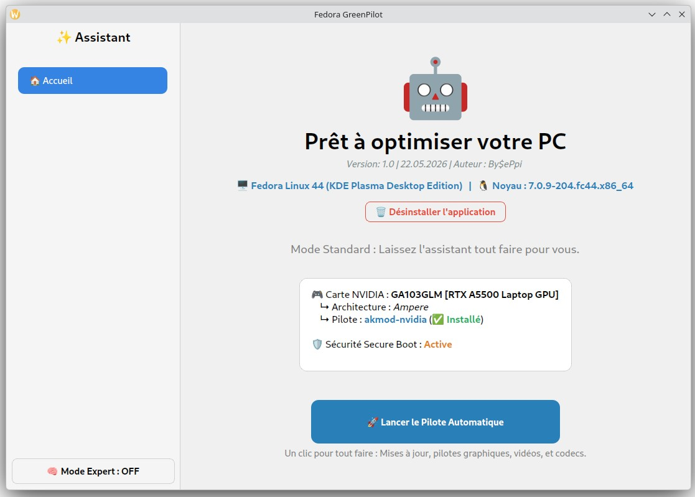
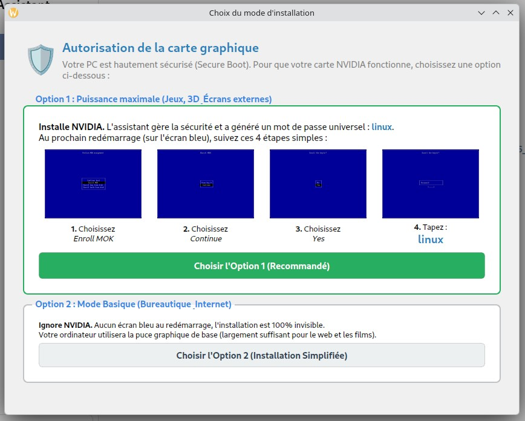
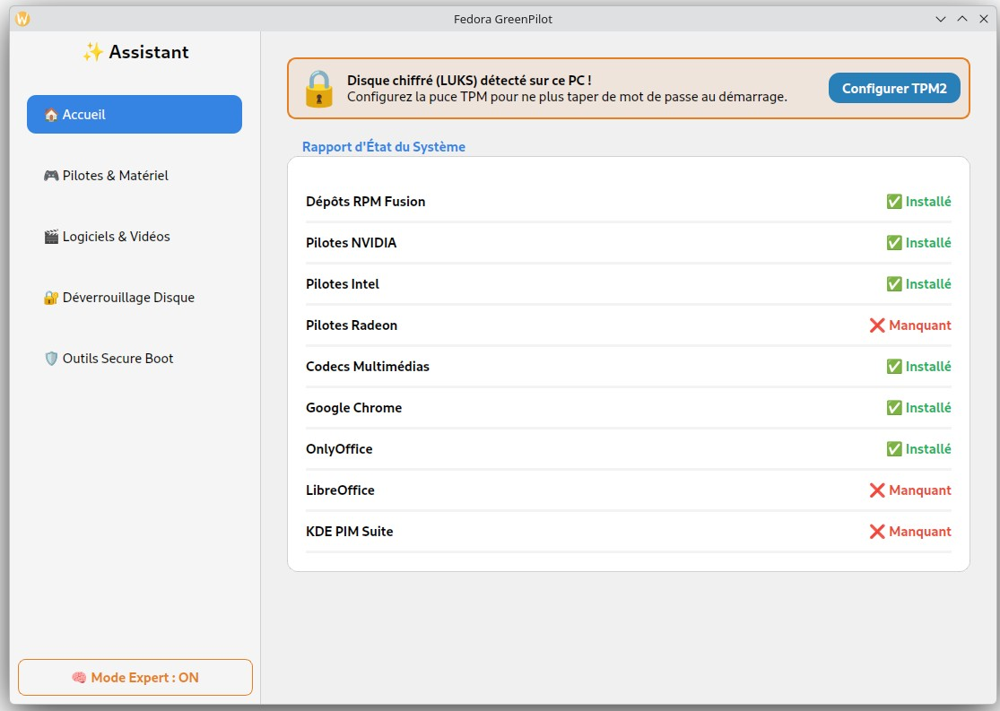

> ⚠️ **DISCLAIMER / AVERTISSEMENT**
>
> **EN:** This program has only been tested on **Fedora 44**. I cannot guarantee its functionality on a wide range of hardware configurations. Use this tool at your own risk. I am not responsible for any system breakage, data loss, or other issues that may occur.
>
> **FR:** Ce programme n'a été testé que sur **Fedora 44**. Je ne peux pas garantir son fonctionnement sur un large éventail de matériel. Utilisez cet outil à vos risques et périls. Je ne suis pas responsable en cas de casse du système, de perte de données ou de tout autre problème.

---

# 🚀 Fedora GreenPilot

**A one-click assistant that configures your Fedora Linux PC for daily use.**

> No Linux expertise needed. GreenPilot handles everything for you: system updates, graphics drivers, video codecs, and more.

---

## 🤔 What is it?

When you install Fedora for the first time, some things don't work out of the box:

- MP4 / MKV videos won't play
- Your NVIDIA graphics card isn't running at full performance
- Installing common software requires typing terminal commands

**FedoraGreenPilot fixes all of this in just a few clicks**, without ever opening a terminal.

---

## ✨ Features

### 🚀 Autopilot Mode — 1 click does everything

Runs all operations automatically, in the right order:

1. Full system update
2. RPM Fusion repositories activation (third-party software catalog)
3. Graphics drivers installation adapted to your hardware (NVIDIA / Intel / AMD Radeon)
4. ⚠️ **If Secure Boot is enabled, a new screen will prompt you for MOK enrollment**
5. Audio & video codecs installation (MP4, MKV, AVI, MP3...) 

### 🎮 Driver Manager

Install or remove graphics drivers individually:

- **NVIDIA** — proprietary drivers with gaming support (32-bit, Gamemode)
- **Intel** — hardware acceleration for integrated Intel GPUs
- **AMD Radeon** — hardware acceleration for AMD GPUs

### 🎬 Software & Codecs

Install the most requested applications in one click:

- FFmpeg & GStreamer (full audio/video support)
- Google Chrome
- OnlyOffice (highly compatible with Microsoft Office)
- LibreOffice
- KDE PIM Suite (mail, calendar, contacts)

### 🔐 Automatic Disk Unlock (TPM2)

If your disk is encrypted (LUKS), configure your TPM chip to **stop typing your password at every boot**, while staying secure.

### 🛡️ Secure Boot Tools

For advanced users: MOK key management (required for NVIDIA with Secure Boot enabled), kernel module recompilation.

---

## 💻 Compatibility

| | Required |
|---|---|
| OS | Fedora Linux (Workstation) |
| Desktop | GNOME or KDE Plasma |
| Internet | Required for installations |
| Rights | Administrator (prompted when needed) |

---

## 📥 Installation

### Option 1 — AppImage (recommended, no installation required)

Download the `.AppImage` file from the [Releases](../../releases) page, then:

```bash
chmod +x FedoraGreenPilot-*.AppImage
./FedoraGreenPilot-*.AppImage
```

Once launched, the app offers to integrate itself automatically into your GNOME or KDE menu.

### Option 2 — From source

```bash
pip install PyQt6
python3 FedoraGreenPilot.py
```

### Option 3 — Build your own AppImage (for developers)

Download the source code, including `FedoraGreenPilot.py`, the images (`*.png`), and `build_appimage.sh`.

Make the script executable and run it:

```bash
chmod +x build_appimage.sh
./build_appimage.sh
```

> **Note:** The script will ask for your administrator password (`sudo`) to install the necessary native Fedora dependencies (PyQt6, GCC, etc.) via `dnf`. It will generate a ready-to-use `.AppImage` file in the same directory.

---

## 🖼️ Screenshots

<p align="center">
  
  
  
</p>

---

## 👤 Author

Made by **By$ePpi**

A little backstory: I am a novice in programming. However, with the help of Gemini, I decided to take some time to build this tool so I could save a lot of time later. For a first experience, I kept the code in a single file block as it was much easier to manage. I hope it saves you some time, too! 😉

---

## 📄 License

[GNU General Public License v3.0](LICENSE)

---

<details>
<summary>🇫🇷 Description en français</summary>

## Un assistant graphique qui configure votre PC Fedora en un seul clic.

Pas besoin d'être un expert Linux. GreenPilot fait tout à votre place : mises à jour, pilotes graphiques, codecs vidéo, et bien plus.

### Pourquoi cet outil ?

Quand on installe Fedora pour la première fois, certaines choses ne fonctionnent pas d'emblée :

- Les vidéos MP4 / MKV ne lisent pas
- La carte graphique NVIDIA n'est pas au maximum
- Il faut taper des commandes dans un terminal pour installer des logiciels courants

**FedoraGreenPilot résout tout ça en quelques clics.**

### Ce que fait l'application

- 🚀 **Pilote Automatique** : met à jour le système, active RPM Fusion, installe les pilotes graphiques et les codecs en un seul clic
- **⚠️ Si le Secure Boot est activé, un nouvel écran vous invitera à procéder à l'enrôlement MOK**

- 🎮 **Gestionnaire de Pilotes** : installe/désinstalle les pilotes NVIDIA, Intel, AMD individuellement
- 🎬 **Logiciels & Codecs** : Chrome, OnlyOffice, LibreOffice, FFmpeg, GStreamer...
- 🔐 **Déverrouillage TPM2** : plus besoin de taper votre mot de passe LUKS au démarrage
- 🛡️ **Outils Secure Boot** : gestion des clés MOK pour les utilisateurs avancés

### Installation

**Option 1 — AppImage (recommandé, aucune installation requise)**

Téléchargez le fichier `.AppImage` depuis la page [Releases](../../releases), puis :

```bash
chmod +x FedoraGreenPilot-*.AppImage
./FedoraGreenPilot-*.AppImage
```

Une fois lancée, l'application vous propose de s'intégrer automatiquement au menu GNOME ou KDE.

**Option 2 — Depuis les sources**

```bash
pip install PyQt6
python3 FedoraGreenPilot.py
```

**Option 3 — Créer sa propre AppImage (pour les développeurs)**

Téléchargez le code source, incluant `FedoraGreenPilot.py`, les images (`*.png`), et `build_appimage.sh`.

Rendez le script exécutable et lancez-le :

```bash
chmod +x build_appimage.sh
./build_appimage.sh
```

> **Note :** Le script vous demandera votre mot de passe administrateur (`sudo`) pour installer les dépendances natives nécessaires (PyQt6, GCC, etc.) via `dnf`. Il compilera l'application et générera un fichier `.AppImage` prêt à l'emploi dans le même dossier.

### Auteur

Créé par **By$ePpi**

Pour la petite histoire : je suis un novice en programmation. Mais grâce à l'aide de Gemini, j'ai décidé de prendre du temps pour développer cet outil afin d'en gagner beaucoup par la suite. Pour une première expérience, j'ai écrit tout le code en un seul bloc (un seul fichier) car c'était beaucoup plus facile à gérer. J'espère qu'il vous en fera gagner aussi ! 😉

</details>
